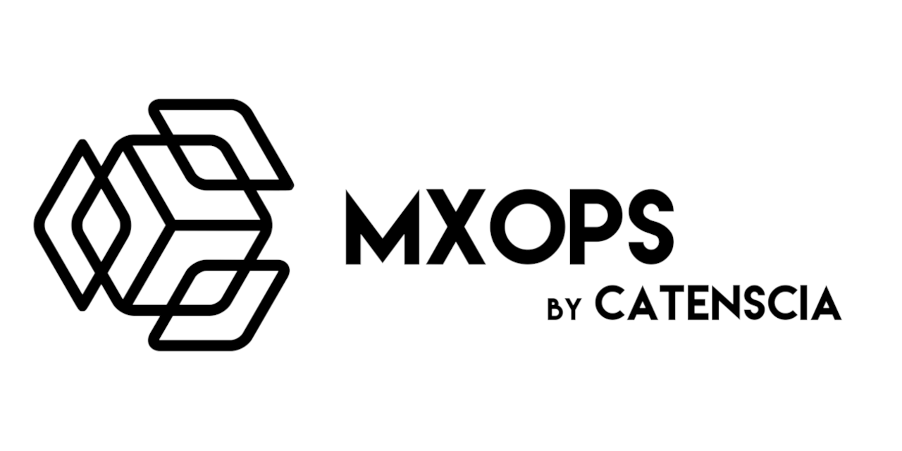

# MxOps




MxOps is tool created to facilitate and automate MultiversX interactions: be it smart contracts deployments, calls, queries or just simple transfers. Inspired from DevOps tools, it aims to ease and make reproducible any set of interactions with the blockchain.

MxOps is built to be especially useful in these situations:

- smart-contract deployment automation
- on-chain integration tests (chain simulator, localnet, testnet or devnet)
- smart-contract interaction automation

The vision of MxOps is that interacting with the blockchain should be straight forward and that even non-technical users should be able to interact with the blockchain at will. For this reason, MxOps will handle all the hassle for you so that you can focus on the core of your activities.

## Sponsors

MxOps is an open-source tool dedicated to enhancing the MultiversX ecosystem, and its development and maintenance rely on the generous support of our sponsors.

We extend our heartfelt thanks to **[Astrarizon](https://www.astrarizon.com)**, the first sponsor of MxOps! ([announcement on X](https://x.com/Astrarizon/status/1861791446099263552))


If MxOps has been beneficial in your projects or professional endeavors, we invite you to join our community of sponsors. Your support will ensure the continued maintenance and future development of MxOps, helping to keep this tool at the forefront of the MultiversX ecosystem.

Interested? Reach out to us at [contact@catenscia.com](mailto:contact@catenscia.com).


## How does it works?

MxOps is built in python, on top of [mx-sdk-py](https://github.com/multiversx/mx-sdk-py), but you don't need to know python nor to be a programmer to be able to benefit from MxOps. Indeed, you only have to write yaml files (aka formated text files) to describe what you want to to.

## Snippets

To give you an idea of how simple it is to use MxOps, you will find below a few yaml snippets for some of its capacities. 

### Token Issuance

Here, MxOps is used to issue a fungible token from an account named by the user as alice:

```yaml
  - type: FungibleIssue
    sender: alice
    token_name: AliceToken
    token_ticker: ATK
    initial_supply: 1000000000  # 1,000,000.000 ATK
    num_decimals: 3
    can_add_special_roles: true
```

### Contract Query

MxOps is used below to fetch information from the [live Onedex contract](https://explorer.multiversx.com/accounts/erd1qqqqqqqqqqqqqpgqqz6vp9y50ep867vnr296mqf3dduh6guvmvlsu3sujc) on mainnet. We specifically query the state of the pool n°9, which is the pool ONE/WEGLD.

```yaml
  - type: ContractQuery
    contract: onedex-swap
    endpoint: viewPair
    arguments:
      - 9  # id of the pair to get the details of
```

```{dropdown} Query results
:class-title: normal-title
:color: light

```json
[
    {
        "pair_id": 9,
        "state": {
            "__discriminant__": 1,
            "__name__": "Active"
        },
        "enabled": true,
        "owner": "erd1xkflzkx3hp52szy26zh9m5ts3v3j4dxhqkpxzj9npzp7wyp6qeysfpqz2m",
        "first_token_id": "ONE-f9954f",
        "second_token_id": "WEGLD-bd4d79",
        "lp_token_id": "ONEWEGLD-892244",
        "lp_token_decimal": 18,
        "first_token_reserve": 1372071779861493216032911,
        "second_token_reserve": 4820163353587346912393,
        "lp_token_supply": 1301904634411268529384,
        "lp_token_roles_are_set": true,
        "unkown": 0,
        "fees": 100
    }
]
```

### Contract Call with Payments

Here, MxOps is used to call a contract while sending tokens. This example shows what it would look like to add some liquidity to a pool.

```yaml
- type: ContractCall
  sender: thomas
  contract: pair-contract
  endpoint: addLiquidity
  esdt_transfers:
    - identifier: TOKENA-abcdef
      amount: 894916519846515
      nonce: 0
    - identifier: TOKENB-abcdef
      amount: 710549841216484
      nonce: 0
  gas_limit: 12000000
```

### Account cloning

Let's say the contract you are developing in dependent of a third party contract for which you don't have the code. MxOps allows you to simply copy entirely this contract, including its code, its storage values and its tokens, so that you can run your tests in mainnet condition but locally on your machine.

```yaml
- type: AccountClone
  address: egld_wrapper_shard_1
  source_network: mainnet
```

```{note}
Cloning accounts necessits to directly write arbitrary values to the blockchain states, so it is only possible on the chain-simulator
```

## Getting Started

You have seen above some basic use-cases but MxOps has much more avaible features!
Heads up to the [documentation](https://mxops.readthedocs.io) to get started! You will find tutorials, user documentation and examples 🚀

## Contribution

This tool is an humble proposal by [Catenscia](https://catenscia.com/) to have a standard way of writing deployment files, integration tests and others.
If you want this tool to improve, please tell us your issues and proposals!

And if you're motivated, we will always welcome hepling hands onboard :grin: !

Read the [contribution guidelines](https://github.com/Catenscia/MxOps/blob/main/CONTRIBUTING.md) for more :wink:
